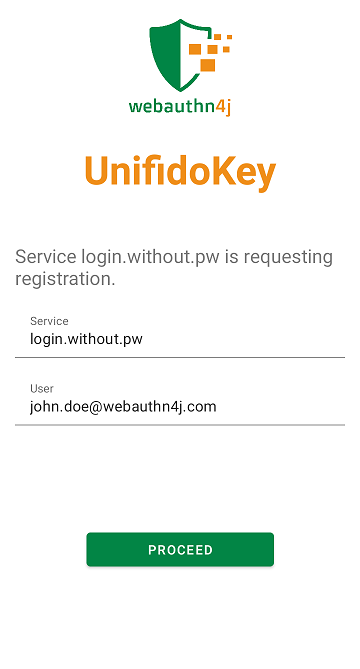
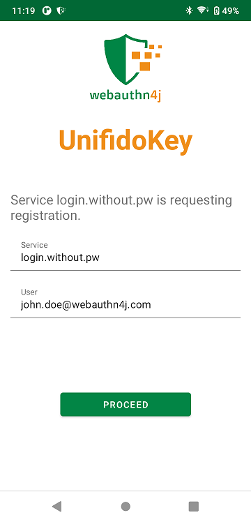

# WebAuthn4J UnifidoKey




[](https://github.com/webauthn4j/unifidokey/actions)

WebAuthn4J UnifidoKey is an Android app which act as a WebAuthn security key.
No longer need to buy an expensive physical security key and carry it everyday. 
Just install the UnifidoKey app to your smartphone, and enjoy secure and convenient authentication.

## Install

Install from Google Play Store.

## Documentation

* [User Guide(en)](https://docs.unifidokey.com/en)
* [User Guide(ja)](https://docs.unifidokey.com/ja)

## Build from source

```
./gradlew build
```

### Build configuration

`unifidokey.androidSafetyNetApiKey` gradle property need to be set via `local.properties` file or `-Punifidokey.androidSafetyNetApiKey=<value>` command line argument for gradle execution.

## License

WebAuthn4J UnifidoKey is Open Source software released under the
[Apache 2.0 license](http://www.apache.org/licenses/LICENSE-2.0.html).

## Contributing

Interested in helping out with WebAuthn4J? Great! Your participation in the community is much appreciated!
Please feel free to open issues and send pull-requests.