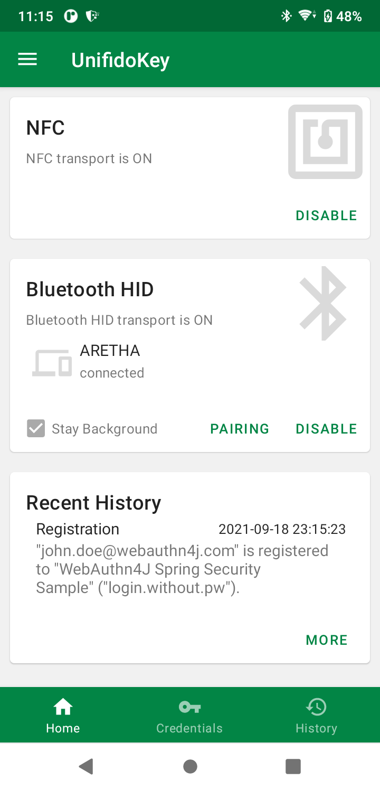

== Introduction

=== What's WebAuthn4J UnifidoKey

https://github.com/webauthn4j/UnifidoKey[WebAuthn4J UnifidoKey] is an Android app, which turns your smart phone to a security key.
You no longer need to purchase an expensive physical security key.
Installing UnifidoKey app makes your smartphone a Bluetooth/NFC connected security key.

=== Install

Install from Google Play Store

==== Tested Configuration

It is tested in the following environment.
However, it may not work due to the Bluetooth/NFC stack configuration.

|==================================================================
| OS                    | Bluetooth HID   |    NFC    | Note

| Windows PC            | OK              |    OK     |
| Mac                   | OK              |    -      |
| Linux                 | OK              |    -      |
|==================================================================

=== Precautions for use

UnifidoKey doesn't provide a backup method for keys stored in UnifidoKey.
In case of device lost or unexpected UnifidoKey bug, please prepare an alternative authentication method to the service other than UnifidoKey so that you can recover your account even if UnifidoKey becomes unavailable.

