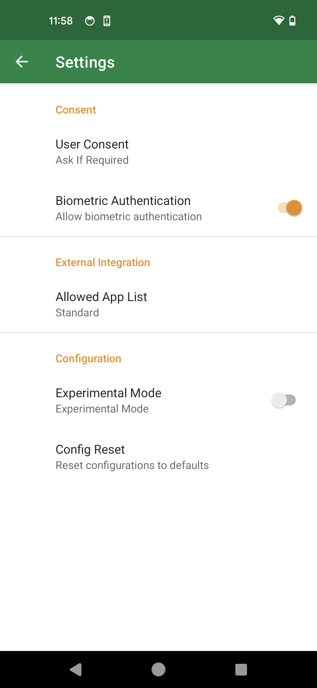

== Settings

Various settings are available on the Settings screen.

=== Transport

==== NFC

Enable/Disable NFC transport.
* Note that this option is only displayed when Experimental Mode is enabled.

// ==== Bluetooth HID
//
// Enable/Disable Bluetooth HID transport.
// * I can also be configurable from the Home screen.
//
// ==== Bluetooth HID Pairing
//
// Make the device discoverable from other nearby bluetooth devices.
// After starting pairing mode, pair and connect from your PC to your smart phone.

=== Consent

==== User Consent

This setting allows you to configure the conditions under which consent is required during registration and authentication.

|==================================================================
| Option                | Description

| If Required           | Confirm only when consent is required by the service
| Consent Automatically | Automatically return a response for consent. No re-authentication is required. Please be aware that convenience comes at the cost of security.
|==================================================================

==== Biometric Authentication

This setting allows you to enable or disable biometric authentication.
If set to OFF, device authentication such as PIN will be required.
You can also configure settings per services from the Accounts tab.

==== Consent Caching

Cache registration / authentication consent action.
This helps consent action under unstable NFC transport.

==== Reset Protection

Rejects the reset command to prevent credentials from unauthorized deletion.

=== User Interface

Settings related to the user interface.

==== Account Selector

This setting configures the user interface for selecting an account when multiple accounts exist during authentication.

|==================================================================
| Option                 | Description

| Authenticator          | Select the account on the authenticator side
| Client Platform        | Select the account on the client side
|==================================================================

==== Keep Screen ON

NFC transport is only available while the screen is on.
This setting make the screen remain ON while the app is open.

=== External Integration

==== Allowed App List

This setting configures the list of applications that can call UnifidoKey as a Passkey Provider.

|==================================================================
| Option                 | Description

| Standard               | Uses standard privileged passkey client app list
| Limited                | Uses limited privileged passkey app list
|==================================================================

=== Configuration

==== Experimental Mode

This setting enables or disables experimental features.

// ==== Developer Mode
//
// 開発者向けの機能を有効にするかどうか設定します。

==== Configuration Reset

Resets the settings to the defaults.

