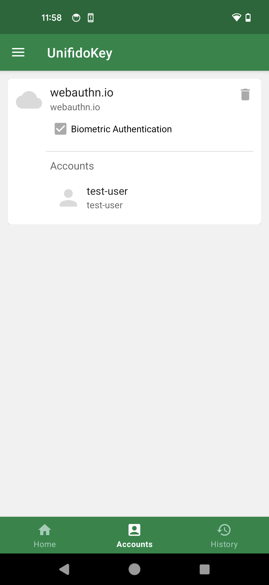

== アカウント管理

"Accounts"タブから登録されたアカウントの管理が可能です。 アカウントは、サービス（Relying Party）毎にグループ化されています。

// === アカウントの検索
//
// 右上の検索ボックスからアカウントの検索が可能です。

=== 生体認証の有効化・無効化

サービス毎に"Biometric Authentication"のチェックボックスで生体認証の有効化・無効化が設定可能です。

=== アカウントの削除

アカウントを削除する場合は、アカウントのメニュー項目を長押しして下さい。 確認ダイアログを経て、アカウントの削除が可能です。

