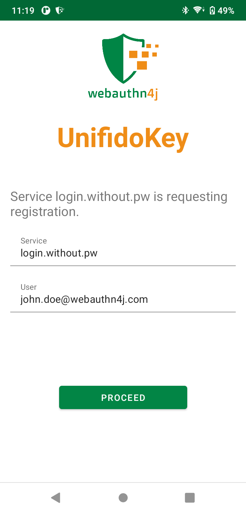
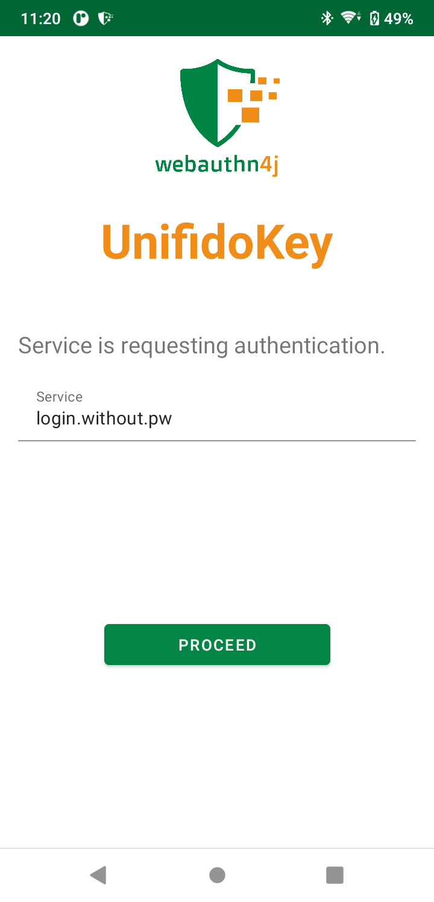

== クイックツアー

=== セットアップ

UnifidoKeyでは、2種類の接続方式が利用可能です。NFC接続と、Bluetooth HID接続です。

==== NFC接続

UnifidoKeyをインストールしたスマートフォンにNFC機能が搭載されており、ご利用のPCにNFCリーダーが接続されている場合、NFC接続でUnifidoKeyを利用することが可能です。

===== NFC 接続の有効化

UnifidoKeyのNFC transportを有効化した上で、PCのNFCリーダーにUnifidoKeyを置くことで利用可能です。
リーダーはNFCに対応している必要があります。FeliCa、MIFAREの読み取りのみに対応したリーダーでは利用することが出来ません。
https://www.amazon.co.jp/-/en/gp/product/B00VR1WARC/[Sony NFC Reader "PaSoRi " RC-S380/S]で動作を確認しています。

==== Bluetooth HID 接続

ご利用のPCでBluetoothが利用出来る場合、Bluetooth HID接続でUnifidoKeyを利用することが可能です。

===== Bluetooth HID 接続の有効化

UnifidoKeyのBluetooth HID transportを有効化した上で、PCとペアリングした上でご利用下さい。

====== ペアリング

UnifidoKeyの"PAIRING"ボタンを押下すると、OSからの確認ダイアログを経て、端末がペアリングモードになります。
その上で、PCからBluetoothデバイスの探索を行い、UnifidoKeyをインストールしたスマートフォンとペアリングを実施してください。

====== Bluetooth HID接続のトラブルシュート

PC、スマートフォン共にBluetoothが有効であるにも関わらずBluetooth HIDのデバイスのステータスが"Connected"にならない場合、
一旦Bluetooth 接続をDisableし、再度Enableにしたり、スマートフォンのBluetooth機能をOFFにし、再度ONにしてみてから
再試行して下さい。

===== Bluetooth HID接続の待受モード

Bluetooth HID接続は、通常アプリの画面が開いている場合のみ接続が有効ですが、"Stay Background"チェックボックスを有効にすることで、
アプリが開いていない場合も接続の待受を有効にすることが可能です。ただし、バッテリーの消費に影響しますのでご注意下さい。
待受中はAndroidの通知メニューに"UnifidoKey Bluetooth HID Service"の表示が現れますので、そちらの"Turn Off"メニューで無効化することが可能です。

=== 登録

PCでWebAuthnに対応したサイトでセキュリティキーの登録を実行して下さい。
例えば、GitHubでセキュリティキーを登録する場合の手順は
https://docs.github.com/en/github/authenticating-to-github/securing-your-account-with-two-factor-authentication-2fa/configuring-two-factor-authentication#configuring-two-factor-authentication-using-a-security-key["Configuring two-factor authentication using a security key - GitHub"]
です。
セキュリティキーの登録が要求されると、UnifidoKeyでは、以下の画面が表示されます。

登録しようとしているサイトの情報と一致しているか確認の上、"PROCEED"ボタンを押下して登録を承認して下さい。

ClientPINを有効にしている場合、初回利用時にPC側のダイアログでPINの設定が求められる場合があります。画面の指示に従い、設定を進めて下さい。

=== 認証

PCでWebAuthnに対応したサイトでセキュリティキーを用いた認証を実行して下さい。
セキュリティキーを用いた認証が要求されると、UnifidoKeyでは、以下の画面が表示されます。

確認の上、"PROCEED"を押下して認証を承認して下さい。

サイトが本人性確認を要求している場合、ClientPINを有効にしている場合、PC側のダイアログでPINの入力、
User Verificationを有効にしている場合、スマートフォン側での生体認証が求められる場合があります。
画面の指示に従い、認証を進めて下さい。

