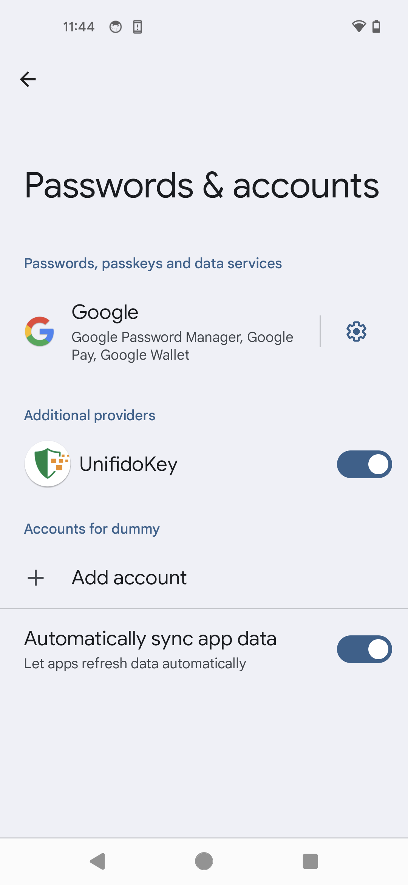
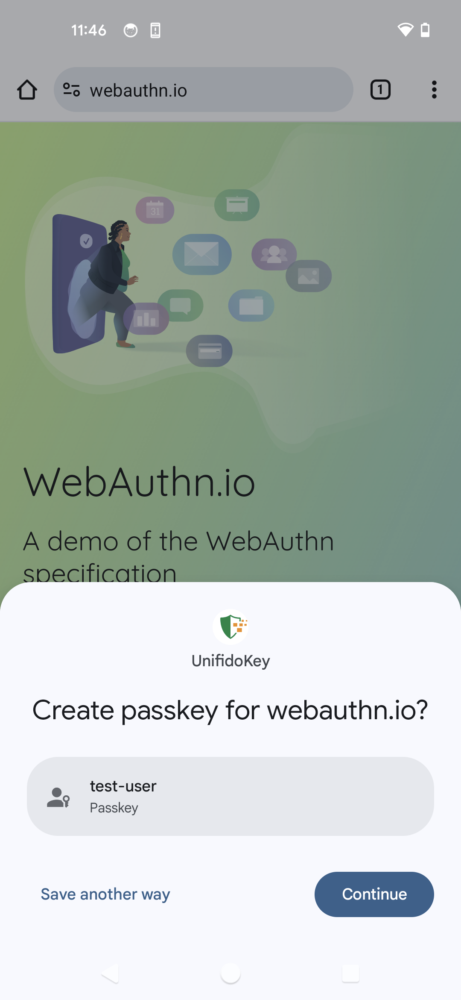
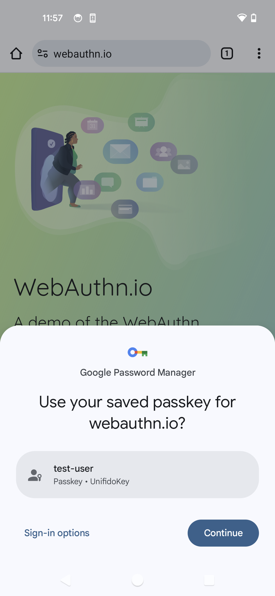

== クイックツアー

UnifidoKeyは、端末内のブラウザか、PasskeyのORコードを通じてペアリングした別のデバイスでPasskeyプロバイダーとしてご利用いただけます。実験的な機能として、NFC接続を通じてFIDO2セキュリティキーとしてご利用頂くことも可能です。

=== 端末内でのブラウザでの利用

==== セットアップ

Android 14以降、UnifidoKeyのようなPasskeyの保管処理を提供するアプリケーション（Passkey Provider）が利用できるようになりました。
UnifidoKeyをPasskey Providerとして利用するためには、Androidの設定画面で、Passkeyの追加のプロバイダーとしてUnifidoKeyを有効化する必要がございます。
設定画面は、UnifidoKeyのホーム画面の「Provider Settings」ボタンから遷移出来ます。

==== 登録

Passkeyに対応したサイトでPasskeyの登録を実行して下さい。 例えば、GitHubでPasskeyを登録する場合の手順は
https://docs.github.com/en/authentication/authenticating-with-a-passkey/managing-your-passkeys#adding-a-passkey-to-your-account["Adding a passkey to your account - GitHub"]
です。 Passkeyの登録が要求されると、以下の画面が表示されます。
もしUnifidoKeyが表示されない場合は、"Save another way"をタップし、UnifidoKeyを選択し直してください。

"Continue"ボタンを押下し、認証の上、登録を完了して下さい。

==== 認証

WebAuthnに対応したサイトでPasskeyを用いた認証を実行して下さい。 Passkeyを用いた認証が要求されると、UnifidoKeyでは、以下の画面が表示されます。

"Continue"を押下し、生体認証か、PINで認証を行って下さい。

=== NFC接続での利用

UnifidoKeyをインストールしたスマートフォンにNFC機能が搭載されており、ご利用のWindows PCにNFCリーダーが接続されている場合、実験的機能としてNFC接続でUnifidoKeyを利用することが可能です。
通常のユースケースではQRコードでペアリングすれば十分であり、NFC接続を利用する必要はありません。

==== NFC 接続の有効化

UnifidoKeyの設定画面からExperimental Modeを有効化し、次にNFC transportを有効化した上で、PCのNFCリーダーにUnifidoKeyを置くことで利用可能です。
リーダーはNFCに対応している必要があります。FeliCa、MIFAREの読み取りのみに対応したリーダーでは利用することが出来ません。
https://www.amazon.co.jp/-/en/gp/product/B00VR1WARC/[Sony NFC Reader "PaSoRi " RC-S380/S]で動作を確認しています。

==== 登録

PCでWebAuthnに対応したサイトでセキュリティキーの登録を実行して下さい。 例えば、GitHubでセキュリティキーを登録する場合の手順は
https://docs.github.com/en/github/authenticating-to-github/securing-your-account-with-two-factor-authentication-2fa/configuring-two-factor-authentication#configuring-two-factor-authentication-using-a-security-key["Configuring two-factor authentication using a security key - GitHub"]
です。 セキュリティキーの登録が要求されると、UnifidoKeyでは、以下の画面が表示されます。

image::../images/registration.png[Registration screen,40%]

登録しようとしているサイトの情報と一致しているか確認の上、"PROCEED"ボタンを押下して登録を承認して下さい。

ClientPINを有効にしている場合、初回利用時にPC側のダイアログでPINの設定が求められる場合があります。画面の指示に従い、設定を進めて下さい。

==== 認証

PCでWebAuthnに対応したサイトでセキュリティキーを用いた認証を実行して下さい。 セキュリティキーを用いた認証が要求されると、Androidでは以下の画面が表示されます。

image::../images/authentication.png[Authentication screen,40%]

確認の上、"PROCEED"を押下して認証を承認して下さい。

サイトが本人性確認を要求しており、ClientPINを有効にしている場合、PC側のダイアログでPINの入力が要求されます。 User Verificationを有効にしている場合、スマートフォン側での生体認証が要求されます。 画面の指示に従い、認証を進めて下さい。

// ==== Bluetooth HID 接続
//
// ご利用のPCでBluetoothが利用出来る場合、Bluetooth HID接続でUnifidoKeyを利用することが可能です。
//
// ===== Bluetooth HID 接続の有効化
//
// UnifidoKeyのBluetooth HID transportを有効化した上で、PCとペアリングした上でご利用下さい。
//
// ====== ペアリング
//
// UnifidoKeyの"PAIRING"ボタンを押下すると、OSからの確認ダイアログを経て、端末がペアリングモードになります。 その上で、PCからBluetoothデバイスの探索を行い、UnifidoKeyをインストールしたスマートフォンとペアリングを実施してください。
//
// ====== Bluetooth HID接続のトラブルシュート
//
// PC、スマートフォン共にBluetoothが有効であるにも関わらずBluetooth HIDのデバイスのステータスが"Connected"にならない場合、 一旦Bluetooth 接続をDisableし、再度Enableにしたり、スマートフォンのBluetooth機能をOFFにし、再度ONにしてみてから 再試行して下さい。
//
// ===== Bluetooth HID接続の待受モード
//
// Bluetooth HID接続は、通常アプリの画面が開いている場合のみ接続が有効ですが、"Stay Background"チェックボックスを有効にすることで、 アプリが開いていない場合も接続の待受を有効にすることが可能です。ただし、バッテリーの消費に影響しますのでご注意下さい。 待受中はAndroidの通知メニューに"UnifidoKey Bluetooth HID Service"の表示が現れますので、そちらの"Turn Off"メニューで無効化することが可能です。
