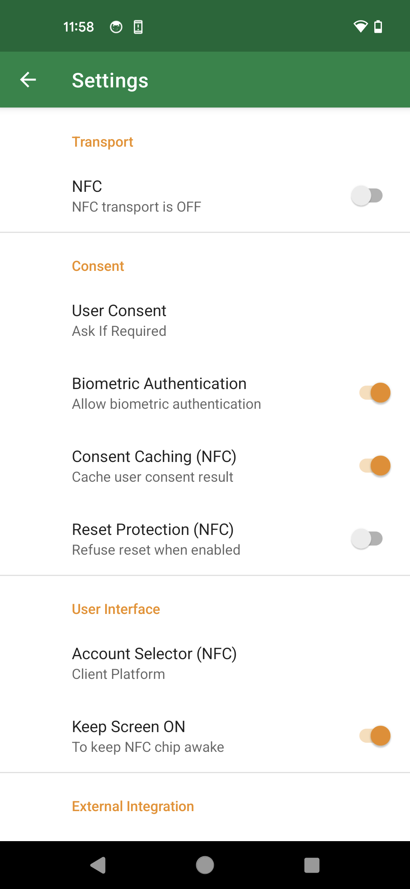

== 設定

ナビゲーションドロワーから開ける設定画面からは、各種設定が可能です。

=== Transport

==== NFC

NFC接続の有効化・無効化を設定します。※実験的な機能のため、Experimental Modeが有効な場合のみ表示されます。

// ==== Bluetooth HID
//
// Bluetooth HID接続の有効化・無効化を設定します。※Home画面からも設定可能です。
//
// ==== Bluetooth HID Pairing
//
// Bluetoothペアリングの為に、デバイスを近傍のBluetoothデバイスから探索可能にします。 実行後、接続したいPCからBluetoothペアリング操作を行い、接続を実施して下さい。

=== Consent

==== User Consent

登録・認証時の同意画面、認証画面の表示に関する設定です。

|==================================================================
| Option                | Description

| If Required           | サイトから同意確認を求められた場合にのみ確認します
| Consent Automatically | 常に自動で同意・認証成功の応答を返却します。再認証も画面ロック解除も求めない為、UnifidoKeyを所持していて、NFCあるいはBluetooth HID接続しているだけで認証が成立します。利便性と引換にセキュリティが低下しているのに注意してください。
|==================================================================

==== Biometric Authentication

生体認証を許可するかどうかを設定します。OFFに設定した場合、PINなど、デバイスの認証が求められます。
Accountsタブから、サービス毎に設定をすることも可能です。

==== Consent Caching (NFC)

登録・認証の承認アクションをキャッシュします。不安定なNFC接続下での承認アクションを安定化します。※実験的な機能のため、Experimental Modeが有効な場合のみ表示されます。

==== Reset Protection (NFC)

リセットコマンドを拒否し、リセットコマンドでアカウントがリセット（削除）されてしまうのを防止します。※実験的な機能のため、Experimental Modeが有効な場合のみ表示されます。

=== User Interface

ユーザーインタフェースに関する設定です。

==== Account Selector (NFC)

認証時、複数のアカウントが存在する場合のアカウント選択ユーザーインタフェースに関する設定です。※実験的な機能のため、Experimental Modeが有効な場合のみ表示されます。

|==================================================================
| Option                 | Description

| Authenticator          | UnifidoKey アプリ画面側でアカウントを選択します
| Client Platform        | クライアント（ブラウザ）ダイアログ側でアカウントを選択します
|==================================================================

==== Keep Screen ON

NFC接続はスクリーンがONの場合のみ有効です。このオプションがONの場合、 アプリを開いている間、スマートフォンのスクリーンがONのままになります。

=== External Integration

==== Allowed App List

Passkey ProviderとしてUnifidoKeyを呼び出すことが出来るアプリケーションのリストの設定です。

|==================================================================
| Option                 | Description

| Standard               | Android標準の信頼するPasskeyクライアントリストに従います
| Limited                | Android標準の信頼するPasskeyクライアントリストの一部のみに限定します
|==================================================================

==== Account Selector (NFC)

認証時、複数のアカウントが存在する場合のアカウント選択ユーザーインタフェースに関する設定です。※実験的な機能のため、Experimental Modeが有効な場合のみ表示されます。

|==================================================================
| Option                 | Description

| Authenticator          | UnifidoKey アプリ画面側でアカウントを選択します
| Client Platform        | クライアント（ブラウザ）ダイアログ側でアカウントを選択します
|==================================================================

=== Configuration

==== Experimental Mode

実験的な機能を有効にするかどうか設定します。

// ==== Developer Mode
//
// 開発者向けの機能を有効にするかどうか設定します。

==== Configuration Reset

設定をデフォルトにリセットします。

